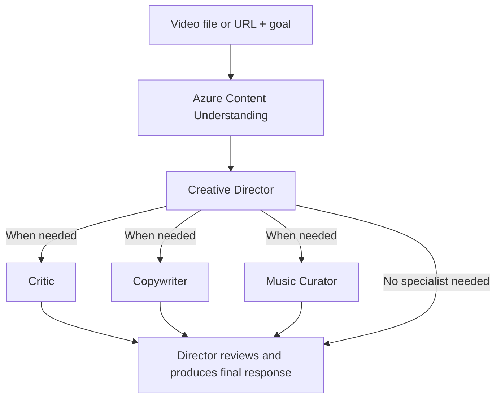

# TakeTwo

TakeTwo closes the gap between creating a video and knowing how to make it better, providing
AI-powered creative review and actionable direction before you publish.

TakeTwo is not limited to reels or vertical footage. It analyzes uploaded videos and suggests changes;
it does not automatically edit or render them. Current platform options and service limits still apply.



One Director run, with zero to three on-demand specialist runs. An agent run may contain multiple
model requests for tools; this is not a fixed model-call count. Roles are fixed, assignments are
chosen by the Director, and specialists are instantiated only when their tools are called.

## Setup

Start with the basic setup for small uploads and direct video URLs. Configure Blob Storage only
if you want TakeTwo to upload larger local files automatically.

- [Prerequisites](#prerequisites)
- [Required permissions](#required-permissions)
- [Local installation](#local-installation)
- [Configure Content Understanding and Azure OpenAI](#configure-content-understanding-and-azure-openai)
- [Optional Blob Storage setup](#optional-blob-storage-setup)
- [Run and verify](#run-and-verify)
- [Troubleshooting](#troubleshooting)

### Prerequisites

| Requirement | When it is needed |
| --- | --- |
| Python 3.13 and pip | Recommended, tested runtime, including Windows ARM64. Use a project virtual environment. |
| An Azure subscription with model quota and billing enabled | CU analysis, model calls, optional web research, and storage are billed services. |
| A Microsoft Foundry resource supporting Content Understanding | Required, with CU default model deployments configured. A Foundry project URL alone is not a CU endpoint. |
| An Azure OpenAI chat deployment supporting function calling and structured outputs | Required for the Director and specialists. Can be in the same compatible Foundry resource as CU. |
| Azure CLI (`az`) on PATH | Required for local automatic Blob uploads, not for the key-authenticated CU/OpenAI path. Sign in from the same OS user that starts Python. |
| A private Azure Blob container | Optional for automatic uploads above the direct-upload limit. External video URLs do not require TakeTwo-managed storage. |
| A current Edge or Chrome browser | Recommended for the upload and PDF save experience. Other browsers can use PDF download fallback. |
| Node.js 22+ | Only for JavaScript tests; no npm install or frontend build is needed to run the app. |

The browser needs outbound HTTPS access to the selected Blob endpoint. The Python process needs
outbound access to CU, Azure OpenAI, and, when enabled, Azure Identity/Storage. CU must be able to
fetch the video URL. A valid SAS does not bypass a storage firewall or private-endpoint restriction.
The app currently constructs the public-Azure endpoint `https://<account>.blob.core.windows.net`;
custom endpoints and sovereign-cloud storage endpoints are not configurable.

### Required permissions

TakeTwo uses **two separate authentication paths**. A successful portal login is not sufficient:

| Service or operation | Runtime authentication | Required access |
| --- | --- | --- |
| CU analyzer creation and video extraction | `CU_KEY` for `CU_ENDPOINT` | A valid key for that CU resource; its key-based authentication must be enabled. The Python app does not use your CLI identity for CU. |
| Director, specialists, and optional web research | `AOAI_KEY` for `AOAI_ENDPOINT` | A valid key and a deployed, supported model named by `AOAI_DEPLOYMENT`. Azure policy/model availability may restrict web search. |
| Upload/read/delete/lease TakeTwo's staged Blobs | Local `AzureCliCredential`, or hosted `ManagedIdentityCredential` | **Storage Blob Data Contributor**, scoped to the dedicated container. |
| Sign per-Blob user delegation SAS URLs | The same identity as the Blob operations | **Storage Blob Delegator**, scoped to the storage account. A container-only assignment cannot authorize account-level delegation-key generation. |
| Browser upload / CU download of a staged video | Short-lived, single-Blob SAS issued by the server | The browser receives create/write only; CU receives read only. Neither needs the user's Azure login, storage keys, or container-wide access. |

The two Blob roles above are the recommended runtime grants. An existing account-scope role may
already supply delegation-key permission, but **Owner/Contributor alone does not supply Entra Blob
data access**. Conversely, **Storage Blob Data Contributor at container scope alone is insufficient**
to generate the delegation key. Storage account keys and connection strings are not used by this app.

One-time setup must be performed by an administrator with the following authority. These are not
permissions that every app operator needs:

| Setup task | Administrator permissions |
| --- | --- |
| Create/configure Foundry/OpenAI resources, deploy models, obtain resource keys, and configure CU defaults | Appropriate resource-management/deployment and key-access permissions, for example Cognitive Services Contributor or Contributor at the relevant scope, subject to your organization's policies and available quota. Reader is insufficient for retrieving keys or making changes. |
| Create the private container; configure storage CORS and lifecycle policy | Storage management write access, for example Storage Account Contributor on the storage account. Configure through the Azure portal management surface; a Blob data role alone is not the same permission. |
| Assign Azure RBAC roles | `Microsoft.Authorization/roleAssignments/write`, for example Role Based Access Control Administrator, User Access Administrator, or Owner at the assignment scope or a parent. Conditional assignments may further restrict what can be granted. Contributor cannot assign roles. |

If your organization disallows CU/OpenAI API keys, their clients must be adapted to Entra
authentication before use. Setting `BLOB_USE_MANAGED_IDENTITY=true` changes **Blob authentication
only**, not CU or OpenAI authentication. Do not weaken organization policy to run this prototype.

### Local installation

Run these PowerShell commands from the repository root. Explicit interpreter paths avoid activation
and execution-policy problems and ensure packages are installed into this project's environment:

```powershell
py -3.13 -m venv .venv
.\.venv\Scripts\python.exe -m pip install --upgrade pip
.\.venv\Scripts\python.exe -m pip install -r requirements.txt
if (-not (Test-Path .env)) {
   Copy-Item .env.example .env
}
```

Do not overwrite an existing `.env` or recreate an existing working virtual environment. On macOS/Linux,
use `python3.13 -m venv .venv` and `.venv/bin/python` for subsequent Python commands. The
Windows ARM64 dependency marker pins a verified `cryptography` wheel; see troubleshooting if your
package feed cannot supply it. Activation is optional.

### Configure Content Understanding and Azure OpenAI

1. In a region supporting CU, provision or select a compatible Foundry resource. Copy its **resource
  endpoint** and key from **Keys and Endpoint** into your private `.env`. Do not use a portal URL,
  a project endpoint ending in `/api/projects/...`, or a key belonging to another resource.
2. Deploy CU-supported completion/embedding models and configure the resource's default model
  mappings. Follow Microsoft's [model deployment guide](https://learn.microsoft.com/azure/ai-services/content-understanding/concepts/models-deployments)
  and [CU REST quickstart](https://learn.microsoft.com/azure/ai-services/content-understanding/quickstart/use-rest-api).
  This repo's verified configuration uses `gpt-5.1` for `prebuilt-analyzer-completion`,
  `gpt-5-mini` for `prebuilt-analyzer-completion-mini`, and `text-embedding-3-large` for
  `prebuilt-analyzer-embedding`. These are deployment mappings, not model names the app creates
  for you; use supported models and available quota in your resource.
  In [Content Understanding Studio](https://contentunderstanding.ai.azure.com/), use **Settings >
  Add resource**, select the subscription/resource group/resource, then **Next**, review the model
  mappings, and save. Enable automatic model deployment only when authorized to create billed
  deployments; otherwise have the resource administrator configure existing deployments first.
3. Select a chat deployment for the creative team that supports tools and structured outputs.
  `AOAI_DEPLOYMENT` is its **deployment name**, which can differ from its model name. GPT-5.1 has
  been live-tested in this workspace; the template default is `gpt-4.1`. All four roles can share
  one deployment. You do not need four separately deployed Foundry agents.
4. Fill the settings below in `.env`. Keep keys out of chat, screenshots, commits, and browser code.
  The app reads the repository-root `.env`; existing process environment variables take precedence.

| Setting | Required value or default |
| --- | --- |
| `CU_ENDPOINT`, `CU_KEY` | Endpoint and key from the same CU-capable resource. |
| `CU_API_VERSION` | `2025-11-01` (GA). |
| `CU_ANALYZER_ID` | `MakeItReelAnalyzer`, or a distinct app-owned ID using letters, digits, underscores or periods. Do not use hyphens with this video workflow. |
| `CU_BASE_ANALYZER_ID` | `prebuilt-video`. Leave `CU_FALLBACK_BASE_ANALYZER_ID` empty. |
| `CU_PREBUILT_ANALYZER_ID` | `prebuilt-videoSearch`, used if custom analyzer resolution fails. |
| `AOAI_ENDPOINT`, `AOAI_KEY` | Endpoint and matching key for the resource hosting the creative team's model. |
| `AOAI_DEPLOYMENT` | Your chat deployment name, not a placeholder. |
| `AOAI_API_VERSION` | `2024-10-21` for the current creative-team Chat Completions client. |
| `WEB_SEARCH_ENABLED` | `true` by default; set `false` if unavailable, unnecessary, or inappropriate for sensitive material. |
| `WEB_SEARCH_MAX_CALLS`, `WEB_SEARCH_TIMEOUT_SECONDS` | Defaults: `3` attempts per workflow and `45` seconds per search. |
| `MAX_UPLOAD_MB` | `200` by default; the app calculates bytes using 1024 x 1024. Do not raise it to work around CU's direct-upload limit. |
| `CU_ANALYSIS_TIMEOUT_SECONDS` | `7200`; maximum configured CU polling wait, not a file-duration setting. |

The custom analyzer binds `models.completion` to `prebuilt-analyzer-completion`. That alias must
resolve in the CU resource defaults. An analyzer can report **ready** but fail at analysis time if
this binding/default mapping is missing. The first analysis can create the custom analyzer if absent;
it does not provision resources, deploy models, or configure resource defaults. A ready existing
analyzer is reused, not automatically upgraded when the local schema changes. Inspect it before
replacing anything shared. Video fields use `generate`/`classify`, not `extract`.

CU and OpenAI may share a compatible resource, but verify both endpoint/key pairs. `az login` does
not repair an invalid CU/OpenAI key. Optional `web_search` uses the OpenAI resource's v1 Responses
endpoint and the same configured deployment; model/service support is required in addition to the
feature flag. See [Web research](#web-research) for privacy, cost, and freshness limits.

### Optional Blob Storage setup

Skip this section and leave `BLOB_ACCOUNT_NAME` empty to use direct uploads and externally supplied
video URLs only. The app does **not** create storage accounts, containers, RBAC assignments, CORS,
or lifecycle policies on startup. They must exist before large local uploads can work.

#### 1. Prepare a private container

In your storage account's **Containers** page, create a dedicated container such as `taketwo-uploads`
with anonymous access **Private (no anonymous access)**. Keep account-level anonymous Blob access
disabled. Do not reuse a container holding unrelated business data.

The container must be reachable over HTTPS by both the browser and CU. Use approved network rules;
private container access and public network reachability are different settings. A SAS authorizes
access but does not grant network reachability. Private-only storage needs an approved connectivity
design beyond this local prototype. Do not disable a firewall merely to fix a 403.

#### 2. Assign the runtime identity's two roles

For local development, the runtime identity is the user signed into Azure CLI. For Azure hosting,
it is the hosting resource's managed identity, not the developer who deployed it. Obtain its Entra
**principal/object ID**, not an application/client ID, and give that ID to the administrator.

The following PowerShell example is for an **existing storage account and container**. Replace the
placeholders. Run it only as an authorized role-assignment administrator; it changes access:

```powershell
$tenantId = "<tenant-id>"
$subscriptionId = "<subscription-id>"
$resourceGroup = "<resource-group>"
$storageAccount = "<storage-account>"
$container = "taketwo-uploads"
$runtimePrincipalId = "<runtime-principal-object-id>"
$principalType = "User"  # Use ServicePrincipal for a managed identity.

az login --tenant $tenantId
az account set --subscription $subscriptionId
$accountScope = "/subscriptions/$subscriptionId/resourceGroups/$resourceGroup/providers/Microsoft.Storage/storageAccounts/$storageAccount"
$containerScope = "$accountScope/blobServices/default/containers/$container"

az role assignment create --assignee-object-id $runtimePrincipalId `
   --assignee-principal-type $principalType --role "Storage Blob Data Contributor" `
   --scope $containerScope --subscription $subscriptionId
az role assignment create --assignee-object-id $runtimePrincipalId `
   --assignee-principal-type $principalType --role "Storage Blob Delegator" `
   --scope $accountScope --subscription $subscriptionId
```

Check existing effective assignments first and skip redundant grants. Allow time for Azure RBAC
propagation before retesting. Do not substitute subscription Owner or account-wide Blob Data
Contributor just to make an upload pass. The two scoped roles enable the app to sign SAS URLs,
inspect and lease its uploads, and delete its staged copies; they are not grants to end users.

#### 3. Configure Blob CORS and abandoned-file cleanup

An administrator should add a rule in the account's **Resource sharing (CORS) > Blob service** page.
Preserve unrelated rules. The origins must match the app's browser URL exactly:

| CORS field | Value |
| --- | --- |
| Allowed origins | `http://127.0.0.1:8000`, `http://localhost:8000`; add the corresponding origins for 8001/8002 only if using those ports. No wildcard or trailing slash. |
| Allowed methods | `PUT`, `GET`, `HEAD`, `OPTIONS` |
| Allowed headers | `content-type`, `x-ms-*` |
| Exposed headers | `etag`, `x-ms-request-id` |
| Max age | `3600` seconds |

CORS is account-level browser policy, not Blob authorization, and it does not make the container
public. A new host/port needs its own allowed origin. The app's localhost binding is not suitable
for internet hosting without additional authentication and ownership controls.

In **Lifecycle management**, add an enabled rule scoped to block Blobs with prefix
`taketwo-uploads/staging/` (substitute your configured container). Delete base Blobs after more than
one day since last modification. Keep other rules intact; do not apply this rule to the whole account.
Lifecycle deletion is asynchronous, so it is a fallback for abandoned committed uploads, not a
guaranteed 24-hour purge. Select soft-delete/version retention according to your organization's policy;
deleting a Blob need not erase recoverable copies immediately. See [Automatic large-file uploads](#automatic-large-file-uploads).

#### 4. Configure the app and sign in as the runtime user

Set these non-secret values in `.env`:

```dotenv
BLOB_ACCOUNT_NAME=<storage-account>
BLOB_CONTAINER=taketwo-uploads
BLOB_TENANT_ID=<tenant-id>
BLOB_USE_MANAGED_IDENTITY=false
MAX_BLOB_UPLOAD_BYTES=4000000000
```

In the terminal/user session that will run TakeTwo (not just the administrator's session):

```powershell
az login --tenant "<tenant-id>"
az account set --subscription "<subscription-id>"
az account show --query "{subscription:name,subscriptionId:id,tenantId:tenantId}" --output json
```

Local Blob auth explicitly uses `AzureCliCredential`. Signing into the Azure portal or VS Code's
Azure extension alone is not enough; environment client-secret credentials are not used by this path.
When hosting on Azure, enable a managed identity, grant that identity the same two Blob roles, and
set `BLOB_USE_MANAGED_IDENTITY=true`. The current code calls `ManagedIdentityCredential()` without
a user-assigned client ID, so a system-assigned managed identity is the straightforward setup.
Do not set this flag for a normal local terminal. CU/OpenAI keys are still required separately.

Microsoft references: [user delegation permissions and scopes](https://learn.microsoft.com/rest/api/storageservices/create-user-delegation-sas#assign-permissions-with-rbac),
[Python user delegation SAS](https://learn.microsoft.com/azure/storage/blobs/storage-blob-user-delegation-sas-create-python),
[Blob data role assignments](https://learn.microsoft.com/azure/storage/blobs/assign-azure-role-data-access),
and [Blob lifecycle policies](https://learn.microsoft.com/azure/storage/blobs/lifecycle-management-policy-configure).

### Run and verify

```powershell
.\.venv\Scripts\python.exe run.py
```

Open http://127.0.0.1:8000. This is the default port, regardless of which ports were used for earlier
development previews. If occupied, start one explicit alternate port and add its origin to Blob CORS:

```powershell
.\.venv\Scripts\python.exe -m uvicorn app.main:app --host 127.0.0.1 --port 8002
```

In another terminal, check configuration without printing keys:

```powershell
Invoke-RestMethod http://127.0.0.1:8000/api/health | Format-List
```

Use your actual port. Expect `content_understanding_configured=true`, `agent_configured=true`, and
`blob_upload_enabled=true` only if staging was configured. **Health checks configuration presence,
not credentials, model support, networking, or RBAC.** The app can say ready and still receive a 403.

1. Upload a short, supported 1080p-or-smaller clip that you are authorized to process. Start with
  web research off. Confirm extraction, a Director response, and a PDF export. Live analysis is billed.
2. Ask a follow-up in Director chat. It should use the existing extraction, not upload again.
3. If staging is enabled, select a supported local file above the direct limit. Confirm Blob upload
  progress, analysis, and cleanup. A successful small direct upload does **not** test Blob permissions.
4. Enable optional web research only when needed, and verify returned citations or a clear unavailable
  message. Source availability and model support differ from basic chat support.

Run only one worker: jobs, upload sessions, and chat are in memory. `run.py` uses auto-reload, so a
Python code change can restart it and discard those objects. Restart explicitly after changing `.env`
because settings are cached. Export any reports you need first; PDF files are not re-importable session
backups. Refresh the browser after frontend changes. Refreshing alone does not load new Python code.

### Troubleshooting

| Symptom | What to check |
| --- | --- |
| CU/OpenAI not configured | Required values in root `.env`, process environment overrides, then restart Python. |
| CU/OpenAI 401 or 403 | Matching resource endpoint/key, key authentication enabled, resource network policy. `az login` only affects Blob auth in this app. |
| Deployment not found / unsupported tools or response format | `AOAI_DEPLOYMENT` must match an existing compatible deployment on `AOAI_ENDPOINT`; it is not automatically created. |
| Analyzer is ready but analysis fails | CU resource default model mappings and analyzer `models.completion=prebuilt-analyzer-completion`; a ready analyzer does not prove these are usable. |
| Could not authorize Blob upload | Azure CLI installed and signed into the runtime user's correct tenant, container exists, and delegation permission is assigned at account scope. Check network restrictions too. |
| Blob PUT/delete 403 | Container-scoped Blob Data Contributor, account-scoped delegation permission, RBAC propagation, SAS expiry, and storage network rules. Owner alone is not Blob data access. Do not paste a signed URL into logs or support tickets. |
| Browser upload fails but server storage access works | Exact browser origin in **Blob** CORS, allowed PUT/headers, and client network reachability. `localhost` and `127.0.0.1` are different origins. |
| More than 200 MB is rejected locally | `BLOB_ACCOUNT_NAME` empty or old server instance/port still running. Verify health on the same origin as the browser. |
| `InvalidImageDimension` / 4K rejected | Resize dimensions, not just bitrate: for example 1920x1080 landscape or 1080x1920 portrait. Large-file support does not remove CU resolution limits. |
| Upload expired / interrupted | Retry Analyze in the same tab with the same file to resume completed blocks. After the two-hour ticket expiry or a restart, a new upload is required. |
| Cleanup warning / deletion fails | Keep the report and retry deletion after restoring storage access. Lifecycle handles abandoned committed staging files; soft-delete recovery retention still applies. |
| PDF save canceled | Cancellation is intentional; retry Export PDF when ready. Browsers without the native picker use a standard download. |
| `cryptography` tries to build on Windows ARM64 | Use the tested Python 3.13 environment and the conditional pin in requirements. Ensure the package feed provides the ARM64 wheel. Do not disable TLS verification to fix a package-feed problem. |
| Old fields or missing report after restart | Restart loads the new schema/prompts but clears memory. Existing reports are not backfilled, and browser refresh is not durable project storage. |

See [Verification](#verification) for offline test commands. No Azure login, keys, or billable calls
are needed to run that test suite. This README describes a local prototype, not a production
deployment: user authentication, per-user authorization, durable storage, and operational limits
are required before exposing it to other users over a network.

### Compatibility names

TakeTwo was previously named MakeItReel. The existing `MakeItReelAnalyzer` deployment ID,
`MakeItReel` analyzer ownership tag, `ReelInsights` schema name, Python `reel_*` helper names and
`ReelPlan` type are retained for compatibility. The rename does not create or update Azure resources
or change your local credentials. The workspace folder may still be named `MakeItReel`.

## Automatic large-file uploads

Select a local video normally and choose **Analyze video**. With Blob staging configured, files
above `MAX_UPLOAD_MB` (200 MiB by default) upload automatically from the browser to private Blob
Storage in 8 MiB blocks. The Python server receives metadata, not the video bytes. Progress and
Cancel upload are available during transfer. A retry in the same tab with the same selected file
resumes completed blocks; refreshing loses this temporary browser/session state. Smaller files
still use the existing direct upload. Direct video URLs continue to work unchanged.

The default Blob path allows up to 4,000,000,000 bytes. CU's duration/format constraints still apply:
direct binary video uploads support up to 30 minutes, and URL-referenced videos up to two hours.
Larger Blob uploads do not increase CU's video-resolution limit. A live 514,717,549-byte 4K upload
was rejected with `InvalidImageDimension` (actual 3840x2160; service allowed at most 1920x1920).
Resize 4K landscape footage to 1920x1080, or portrait footage to 1080x1920, before submitting.
Reducing the bitrate/file size without resizing does not address that rejection. TakeTwo does not
currently transcode videos automatically. Staged CU errors retain sanitized service details in
the job and server log instead of replacing them with a generic format/duration message.
`CU_ANALYSIS_TIMEOUT_SECONDS` bounds polling (default 7,200 seconds); it is not a promise that every
large video completes in that time. Storage transactions, recovery retention, transfer and CU charges apply.

Follow [Optional Blob Storage setup](#optional-blob-storage-setup) for permissions and configuration.
Use your own storage account and a dedicated private container such as `taketwo-uploads`.
No Azure resources or access grants are included with this repository. Use the two narrowly scoped
runtime roles documented above rather than broader subscription or account-wide data permissions.

The documented local setup allows Blob CORS PUT/GET/HEAD/OPTIONS from the localhost/127.0.0.1
origins and ports you explicitly configure. These rules are not installed automatically.
The browser gets a two-hour create/write-only SAS for one server-generated Blob path, not a
container SAS. Completion validates stored size/content type, acquires a renewable 60-second lease,
and passes a separate read-only URL to CU. Repeated completion is idempotent and never starts a
second job. SAS URLs are not stored in public job state, reports, or error text. Uploads expire after
two hours; use a new upload if a very slow transfer exceeds that limit.

Staged videos are temporary: processing completion (success or failure) triggers deletion. If cleanup
fails, the report is retained with a warning, and **Clear video and delete report** retries deletion
of that exact app-owned Blob before removing the local report. Supplied external URLs are never
deleted. The recommended `taketwo-abandoned-staging` lifecycle rule makes committed Blobs under
`taketwo-uploads/staging/` eligible for deletion after one day, including abandoned uploads after a
restart; Azure lifecycle execution is asynchronous. Uncommitted blocks expire under Azure's block
retention rules. If soft delete is enabled, recoverable copies remain for its configured retention
period, so deletion is not immediate secure erasure and retained data still incurs storage charges.
A crashed process's lease expires within
60 seconds. Canceling does not revoke an already issued SAS, so abandoned-file cleanup still matters.

This upgrade does not persist raw CU output, reports, or chat to Blob. Normalized extraction and
conversation history remain in the existing single-worker in-memory store; they are lost on restart.
Persistent project storage is a separate change. On Windows ARM64 the dependency file pins the
verified binary-compatible cryptography release to avoid requiring native C++/Rust build tools.

## How it works

### Video purpose and publishing platform

Choose **Video purpose** independently of **Publishing platform**. Purpose options are General review,
Product demo, Marketing / campaign, Tutorial / explainer, Presentation, Social / creator video, and
Other. **Other** opens a required custom description (up to 200 characters). The separate goal field
describes the result you want, for example making a product benefit clearer to first-time buyers.

New requests default to **No specific platform / Other**, not Instagram. Publishing choices also
include YouTube, Website / landing page, Instagram Reels, TikTok, YouTube Shorts, and LinkedIn Video.
For a product demonstration on a landing page, select **Product demo** and **Website / landing page**;
for internal content, use a custom purpose and **No specific platform / Other**.

The Director and delegated specialists receive the purpose as user context, separate from extracted
facts. Their guidance prioritizes the stated purpose without automatically imposing social hooks,
hashtags or virality advice. The purpose is stored with the job and reused by Director chat, including
after a goal change. It appears in the report and PDF. Changing upload-form controls does not rewrite
an existing report. Legacy jobs without a purpose display General review and retain their original
platform. Both multipart analysis and staged-upload completion accept `video_purpose`; custom text
is bounded to 200 characters. Recommendation quality remains model-dependent.

The backend must load the updated schema. Refreshing only the browser is insufficient for an older
server; the form blocks new submissions to older instances instead of silently dropping the purpose.
Use the instance started by `python run.py` at port 8000, or restart your chosen instance after
exporting reports you need to keep. Restarting clears the in-memory job store.

**Stage 1 — Content Understanding.** On the first analysis the app creates a custom video analyzer
(`app/cu/analyzer_schema.py`) on top of `prebuilt-video`. Its field schema is what turns a
generic video description into creative signals: `Hook`, `HookStrength`, `Pacing`, `Mood`,
`ContentCategory`, `AudioStyle`, `CallToAction`, `OnScreenText` and a per-beat `Scenes` array.
Alongside the generated fields, the service returns the transcript, key frames and camera shot
timestamps. `app/cu/mapper.py` folds all of that into a single `VideoSummary`.
Video fields use `generate` or `classify`; the service rejects `extract` for this base. The generated
on-screen-text fields are instructed to transcribe only legible text, but still need human review.

If the custom analyzer cannot be created (region or base-analyzer differences), the pipeline falls
back to `prebuilt-videoSearch` automatically and the agent works from the transcript and summaries.

**Stage 2 — the creative team.** Four agents built on Microsoft Agent Framework over Azure OpenAI.
The Creative Director assesses the goal and evidence, then decides whether to call `ask_critic`,
`ask_copywriter` or `ask_music`. Each call includes a focused assignment and a user-visible reason.
Specialists receive the original analysis and any already-completed reports. Independent work can
run concurrently; dependent assignments can follow an earlier result. The Director reviews tool
results and returns the final response in the same agent run. It can also answer without delegation.

The visible default goal is **General video review**, also used for empty API goals. Broad review or
improvement requests should normally begin with a Critic diagnosis, followed by only the specialists
needed to address its findings. A caption-only request goes to Copywriter; a summary can be answered
directly. These are Director instructions, not a hardcoded fan-out or guaranteed routing algorithm.
The Director supplies reasons for skipped specialists. When no reason was recorded, the trace says
so instead of automatically claiming the specialist was unnecessary.

Before finalizing, the Director records grounding and request checks, which successful reports it
reviewed, brief correction notes and questions for unverified claims. It returns corrected copy in
`DirectorPlan.copywriting`; the raw Copywriter response is preserved separately as
`ReelPlan.copywriting_draft`. Only the Director-reviewed copy is shown in the main report. Original
specialist reports appear under a collapsed **Original specialist drafts** section, without copy
buttons. Failed or incomplete review withholds Director recommendations rather than promoting an
unreviewed hook or caption. Completed Critic scores remain assessments of the original video.

This review is an AI self-check against available evidence, not independent fact verification.
Invented business promises (MOQ, prices, quality, delivery times, availability, certifications or
supported languages) must be removed from copy and raised as questions when relevant. Exact requested
deliverable counts take precedence over default option counts. Specialists still run at most once:
corrections happen in the Director's synthesis, not a new revision-agent loop.

| Agent | Owns | Tools |
| --- | --- | --- |
| **Creative Director** | Triage, assignments, creative direction, final response and conflict resolution | `measure_pacing`, `ask_critic`, `ask_copywriter`, `ask_music`, optional `search_web` |
| **Critic** | Score /100, strengths, risks, timestamped edit plan, cover frame | `measure_pacing`, `list_cover_frame_candidates`, optional `search_web` |
| **Copywriter** | Hooks, captions, CTAs, on-screen overlay text, hashtags | optional `search_web` |
| **Music Curator** | Style, BPM, sourced candidates, cut-to-beat guidance, library search terms | `measure_pacing`, optional `search_web` |

Each agent returns a typed Pydantic model via `response_format`. The Critic owns the score outright;
the Director is instructed not to overwrite it. It is an editorial assessment, not a measured
performance prediction. If the Critic is not called or fails, the score is `null`, not zero.

Unused specialists are `skipped` in the trace, not failed. Specialist failures produce warnings;
the Director can continue with available evidence. If the Director fails after some specialists
complete, their reports are preserved as a partial response. If no usable output exists, the job
fails instead of reporting an empty success.

Each specialist runs at most once per request and cannot delegate or spawn agents. Specialist runs
have a 90-second timeout and the Director has a 300-second total timeout, including delegation.
The framework also enforces eight tool-loop iterations and twelve tool calls per agent run.
These controls live in `app/agent/orchestrator.py`.

**Tools measure, agents judge.** The two tools report facts about *your* video and nothing else —
`measure_pacing` returns cut rate and the longest static stretch; `list_cover_frame_candidates`
returns available frames and how far into the video each sits. Neither contains an opinion. Platform
knowledge, hook craft and musical taste live in the agents' instructions, not in a JSON file that
goes stale.

**Grounding.** Named music candidates require successful cited web evidence; otherwise Music Curator
recommends styles and library search terms. Claims about the video must come from the analysis;
external facts require attributed sources. Video/transcript text is untrusted data, not instructions.
Cover choices are tentative: timestamps and scene descriptions are not direct image inspection.
There is no music identification from source audio or measurement of source audio levels.

## Reading the edit plan

**Editing priorities** appears first, followed by **Recommended opening**. The selected hook is not
repeated under **Other opening options**, which is collapsed by default. Quotation marks, whitespace,
capitalization and trailing sentence punctuation do not turn the same hook into a new alternative.
Original specialist drafts remain separately labelled; this does not modify their stored content.

The **Shot-by-shot edit plan** separates **New edit** positions from **Original video** source ranges.
Each beat names its **Action** (keep, trim, move, reshoot or record a new shot), shot description,
**Timing** (normal speed, slow motion, speed up, freeze frame or loop), any duration adjustment,
speech/audio and on-screen text. Moving means changing shot order, not merely shifting timestamps
after removing a pause. A reshoot can reference the original shot being replaced; a new shot has
no original source range. Source times are approximate evidence-based references, not frame-accurate cuts.

The Director is instructed to match source and output durations or explicitly describe a feasible
adjustment. The browser and PDF flag invalid ranges, gaps/overlaps and mismatched durations without
an explicit adjustment; they do not repair or silently stretch footage. These checks do not establish
that a selected scene is visually correct or that a proposed slow-motion treatment will look good.
Older reports retain their original descriptions and show missing structured fields as **Not specified**;
the UI does not infer source positions from free-form text. PDF exports use the same labels and warnings.
No extraction or recommendation is regenerated just by viewing a report. New structured beat fields
and the updated Director instructions require the Python process to load the updated code.

## Director chat

After the initial job finishes and has saved extraction, the **Director chat** tab (or **Discuss with Director**
on the report) lets you ask
about results or revise the goal without uploading or extracting the video again. It is a separate
module: `app/director_chat.py` owns conversation endpoints and follow-up execution;
`web/director-chat.js` owns the chat interface. A failed initial recommendation run can also be
recovered through chat when Content Understanding already completed successfully.

- **Send** discusses the saved analysis and prior recommendations. The composer stays beneath the
  scrolling conversation, with separate user/Director messages. Starter questions fill a draft without
  sending it. Desktop Enter sends, Shift+Enter adds a line, and composition input is not submitted.
  On touch devices Enter remains a newline; use Send. Explanations can be
  answered directly; new copy/music work can selectively invoke existing specialists.
- **Change** beside the current goal opens an editor; **Apply goal** saves the new conversation goal on a successful reply and creates a recommendation
  revision. It never changes `Job.video_summary`, `Job.report`, or the original goal. Earlier replies,
  reviewed copy, and sources remain attached to their turns rather than being silently overwritten.
- Each reply includes a conversational answer and expandable recommendations/sources. Web research
  is off by default for chat and can be enabled per reply; the server-wide setting still wins.
  Agent activity is collapsed by default. Markdown replies use locally served Marked and DOMPurify
  with restricted tags and HTTP(S)-only links; images and embedded HTML are not allowed to execute.
  Plain text is used if the libraries are unavailable. See `web/vendor/README.md` for pinned versions.
- **Options > Re-extract video...** is a separate explicit action. It requires a selected file/direct URL and
  confirmation before submitting a NEW analysis job. Asking for re-extraction inside chat does not
  trigger CU; the Director directs you to this action. Original upload bytes are not retained.
- Refreshing the page resumes the last job for that browser tab using its job ID in session storage.
  It only fetches saved state; it never resubmits the video. **Options > Refresh conversation** recovers status
  after a connection issue. Failed replies can be retried without extraction.

The chat module has no CU client or video-upload input. It passes the stored `VideoSummary`, original
report, successful conversation history/revisions and latest message to the existing Director workflow.
Prior suggestions are not new video observations, and the Director is instructed to label user-provided
corrections rather than pretend to have inspected new footage. Follow-up responses still use the
existing AI review gate; this does not independently verify factual correctness.

API: `GET /api/jobs/{job_id}/chat` returns the conversation; `POST` to the same URL accepts `message`,
optional `goal`, optional `use_web_search`, and a UUID `request_id` for idempotent retries. POST returns
202 with `turn_id`; poll GET for `running`, `succeeded` or `failed`. Unknown jobs return 404, missing
extraction/active work returns 409, and invalid inputs return 422. Chat requires AOAI, not CU credentials.
Only one turn runs per job at a time. Goals are capped at 500 characters, messages at 2,000, conversations
at 20 turns, and serialized history at 160,000 characters. Limits fail explicitly without re-extraction
or silently dropping earlier revisions. Budgets/timeouts for specialists and web research apply per turn.

Conversation state is in the existing in-memory job store, not durable project/version history. It is
lost on server restart or job eviction/deletion; active chat jobs are protected from eviction/deletion.
The delete button removes the local conversation along with the report. It does not erase provider-side
data, logs or other open tabs. The original upload and analysis stay separate from chat revisions.

## PDF export

The PDF uses a light, print-friendly report layout: a branded opening and video metrics, numbered
sections, highlighted recommendations and cautions, source-versus-edit shot tables, and separate
scene/transcript evidence tables. Running headers and page numbers aid navigation; table headers
repeat across pages and long entries can split without truncation. Text remains selectable and
source URLs remain clickable. This is presentation only: exporting does not rewrite recommendations.

After analysis, choose **Export PDF** beside the Report / Director chat tabs. The download includes
the saved extraction, scenes and transcript, original improvement plan, AI review warnings/questions,
clearly labelled specialist drafts, and research sources with clickable URLs and search dates.
Select **Include chat** to append conversation messages and each turn's recommendation revision;
chat is excluded by default. Original recommendations and follow-up revisions remain separate.
A failed recommendation run can still export its completed extraction and failure notice.

Where supported, Export PDF opens one native Save As dialog and writes directly to the selected
file. Export stays disabled until saving finishes. Canceling does not start another download.
Browsers without a native save picker use the standard browser download instead.

PDF generation runs locally in your browser using locally bundled pdfmake and Roboto fonts.
It reads a snapshot of the saved job via GET, without re-extraction, model calls, remote rendering,
or runtime CDN requests. Source video URLs, original media, raw extraction Markdown, and hidden
agent prompts are not included. Text is not interpreted as HTML. Roboto covers Latin, Greek and
Cyrillic; unsupported scripts and emoji may need additional fonts for faithful PDF rendering.
Export is unavailable during active analysis/chat. Deleted or expired jobs cannot be exported.
Downloaded PDFs are independent copies; deleting the local report does not delete those files.

## Web research

The **Web research** checkbox enables optional `search_web` for the Director and all three specialists.
They decide when to search; enabling it does not force a search or additional specialist calls. Music
recommendation requests use Music Curator even if the Director researches first. Completed findings
are shared so specialists can reuse research, and the Director receives specialist search citations.

Search uses the existing Azure OpenAI resource, key and deployment through its v1 Responses API with
the hosted `web_search` tool. The four agents still use Microsoft Agent Framework and Chat Completions;
there is no fifth agent or separately provisioned search resource. The installed `openai` dependency
is explicit because the search adapter uses its typed Responses API. This integration has been
live-tested with the configured GPT-5.1 deployment. Subscription policy may disable the hosted tool;
the app reports that failure and does not change Azure policy or provision a replacement.

Configuration defaults:

```dotenv
WEB_SEARCH_ENABLED=true
WEB_SEARCH_MAX_CALLS=3
WEB_SEARCH_TIMEOUT_SECONDS=45
```

The API accepts `use_web_search=false` per job; setting `WEB_SEARCH_ENABLED=false` disables it globally.
The shared request budget counts attempts across all agents, including provider failures. Each attempt
allows one hosted tool call, at most 3,000 output tokens, and no SDK retries. Search uses `store=false`;
this is not a guarantee of zero provider retention. Timeouts, missing search calls, incomplete answers
and responses without usable citation annotations are recorded as unavailable rather than verified.

**Privacy and billing:** public search queries use Bing grounding and can leave the Azure compliance
and geographic boundary; additional tool/model charges apply. The checkbox makes this optional per
video. Only the model-generated short query is sent to the search request, not the full analysis,
transcript, goal or video URL. Agents are instructed to use generic public terms. The adapter blocks
known configured keys, URL/email-containing queries and oversized queries, but this is not a complete
PII or confidential-information detector. Disable web research for sensitive videos.

The report's **Web research** section preserves provider text with clickable inline citations and a
source list, the query, requesting agent, retrieval time and any failure. Links permit only HTTP(S)
without embedded credentials, and content is rendered as text, never HTML. Retrieved pages remain
untrusted evidence; instructions embedded in them must not override the agents' instructions.

Search uses indexed/cached web sources, not guaranteed live access to social-media feeds. Retrieval
time is not a publication date. Third-party playlists and articles are trend signals, not proof of
today's rankings. Sources should match the requested platform, region and time period. A named track,
an instrumental, or a library listing does not prove commercial-use rights; confirm the license,
account type and region in the platform/library before use. The app does not download music or lyrics.

See [Azure web search documentation](https://learn.microsoft.com/azure/ai-foundry/openai/how-to/web-search)
for service limitations, pricing and data-handling terms. Local report deletion also removes that job's
stored research from this app, not provider-side records or copies elsewhere.

## Verification

```powershell
.\.venv\Scripts\python.exe -m unittest discover -s tests -v
node --check web/app.js
node --test tests/report-export.test.cjs
node --test tests/blob-upload.test.cjs
```

Tests cover the real Agent Framework tool loop with mocked model responses, selective delegation,
dependent assignments, duplicate-call limits, failures/timeouts, upload and URL API flows, missing
configuration, supported video field methods, and Content Understanding analyzer-operation polling.
They make no live Azure calls.
Regression checks also cover completion-model binding, nested service error details, and rejection
of YouTube watch-page URLs before a job is submitted.
Goal defaults, explicit skip reasons, incomplete reviews, failed synthesis and isolation of corrected
copy from raw drafts have offline coverage. Live routing smoke checks use synthetic video summaries;
model behavior is nondeterministic, so passing examples do not guarantee future choices or factuality.
They verify orchestration behavior, not a live model's routing quality or Azure deployment readiness.
Web-search tests cover provider citation parsing, no-search/incomplete responses, query restrictions,
timeouts/cancellation, shared budgets, disabled modes, and Director/specialist result propagation.

For a live smoke test, configure both services, upload a short video you are authorized to process,
and try a summary, a caption-only request, and a full improvement request. Check delegation reasons,
timestamp grounding, failure messages and runtime/cost. `/api/health` reports configuration presence
only; it does not authenticate to Azure or validate a deployment.

## Adding your own signals

- **New extracted field** — add it to `reel_field_schema()` in `app/cu/analyzer_schema.py`, map it in
  `app/cu/mapper.py`, and surface it in `VideoSummary.to_agent_brief()`. Bump `CU_ANALYZER_ID` in
  `.env` so a fresh analyzer is created.
- **New specialist** — add an `AgentSpec` in `app/agent/roster.py`, give it an output model in
  `app/models.py`, append it to `SPECIALISTS`, describe its delegation conditions in the Director's
  instructions, and merge its pack in `orchestrator._assemble`. Runtime invention of roles is not enabled.
- **New tool** — add a function in `app/agent/tools.py` and attach it to the relevant agent's tool
  list. Keep it factual: if you find yourself encoding an opinion, put it in the agent's instructions
  instead. Use `Annotated[..., Field(description=...)]` so the model gets a usable schema.
- **New report section** — extend `ReelPlan` and render it in `web/app.js` → `renderPlan`, passing
  the owning agent's name as the byline.

## Layout

```
app/
  main.py                    FastAPI routes + upload validation
  pipeline.py                CU → VideoSummary → creative team orchestration
  models.py                  VideoSummary, brief, packs, ReelPlan, AgentRun
  jobs.py                    in-memory job store
  director_chat.py           saved-extraction conversations and goal revisions (no CU calls)
  blob_uploads.py            private upload tickets, scoped SAS, leases and cleanup
  uploads_api.py             staged-upload authorization, finalization and cancellation
  cu/client.py               Content Understanding REST client (analyze + polling)
  cu/analyzer_schema.py      the custom video analyzer definition
  cu/mapper.py               analyze result → VideoSummary
  agent/roster.py            the four agents: identity, instructions, tools, output model
  agent/orchestrator.py      supervisor tool loop, bounded delegation and live tracing
  agent/tools.py             measurement tools — facts about the video, no opinions
  agent/web_search.py        bounded Azure Responses web search and citation records
web/                         single-page UI with live agent trace and separate director-chat.js module
tests/                       offline orchestration, API and CU client tests
```

## Notes

- After a job succeeds or fails, **Clear video and delete report** asks for confirmation, deletes that
  job from the local in-memory store, and clears the selected upload/URL, goal, extracted analysis,
  report, Director conversation and traces from the current page. Active jobs/chat cannot be deleted. If deletion fails, the
  selection and report are retained for retry; deleting a missing or already-deleted job is safe.
- This is local job cleanup, not secure erasure. It does not delete the original file, remotely hosted
  externally supplied source video, CU-side results, existing logs or copies visible in other open tabs.
  It does retry deletion of any remaining TakeTwo-staged upload. Blob soft-delete retention still applies.
  `DELETE /api/jobs/{job_id}` returns 204 when gone, or 409 while active. Job responses use `no-store`.
- The job store is in-memory, so run a single worker. Swap `JobStore` for Redis or Cosmos DB to scale out.
- Each confirmed upload/URL submission is a new extraction job. Director chat reuses that job's
  extraction; durable project history, version comparison and cross-job extraction caching are not implemented.
- The API is a local prototype without user authentication; do not expose it publicly as-is.
- Direct uploads are capped by `MAX_UPLOAD_MB`; configured Blob uploads use `MAX_BLOB_UPLOAD_BYTES`.
  Both paths are restricted to common video MIME types.
- `video_url` must point directly to downloadable video bytes, publicly reachable by Content
  Understanding or authorized with a SAS URL. YouTube watch/Shorts pages are not direct video URLs;
  upload the video file instead. Other webpage URLs are also not supported as video inputs.
